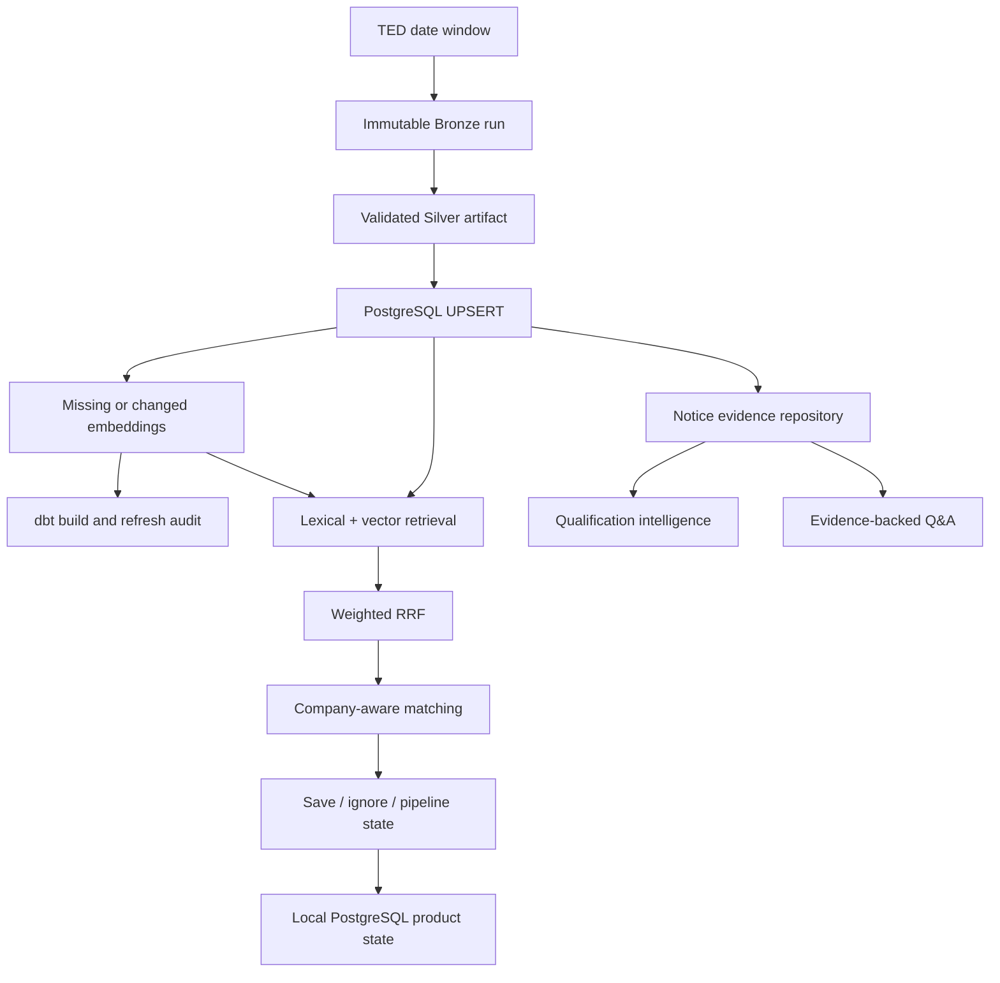

# TenderGraph — European Tender Intelligence

TenderGraph is a local-first procurement intelligence product for finding, qualifying, and tracking European public-sector opportunities from TED. It combines an incremental data platform, hybrid retrieval, company-aware matching, evidence-backed question answering, durable opportunity state, and deterministic qualification signals in one FastAPI workspace.

Built by **Tanjim Hossain** with Python, PostgreSQL/pgvector, dbt, FastAPI, sentence-transformers, and optional local Ollama generation.

## Product workflow

TenderGraph currently supports the first two stages of the procurement opportunity workflow:

1. **Find the right tender** — describe a company profile and rank TED notices by capability relevance, target country, contract value, and response window.
2. **Decide what deserves review** — save opportunities, track a bid/no-bid pipeline, and inspect evidence-grounded requirement, document, deadline, and potential hard-gate signals.

The product intentionally does **not** treat a fit score as a win probability or an automated qualification review as a legal eligibility decision. Users are directed back to the official TED notice before acting.

## What is implemented

- **Data engineering:** immutable Bronze runs, typed Silver normalization, validation, transactional notice UPSERTs, selective vector updates, dbt marts, refresh audits, and overlapping incremental refresh windows.
- **Information retrieval:** PostgreSQL full-text search plus multilingual-e5-small embeddings, combined with weighted reciprocal-rank fusion and evaluated against a committed judged query set.
- **Company matching:** profile-aware tender ranking with semantic fit, country/value/deadline signals, explainable match reasons, and risk hints.
- **Opportunity workflow:** save/ignore feedback, Reviewing / Qualified / Bid planned / No-bid stages, decision notes, and durable PostgreSQL-backed product state with browser cache fallback.
- **Qualification intelligence:** deterministic extraction of supported requirement and document signals from indexed TED notice text, including explicit-vs-mentioned evidence, deadline risk, potential hard-gate flags, and next review actions.
- **Evidence workspace:** evidence selection, cited answers, abstention, and official TED source links; local Ollama generation is optional.
- **Operations:** scheduler wrapper, freshness monitoring, reproducible CI, real PostgreSQL smoke tests, and optional API container packaging.

## Qualification intelligence boundary

`GET /qualification/{publication_number}` reviews only information already indexed from the TED notice, currently including fields such as the notice description, lot description, procedure metadata, value, and deadlines.

The v1 extractor recognizes selected multilingual signals for areas such as:

- ISO 27001 / ISO 9001 / ISO 14001
- security clearance
- annual turnover and professional-liability insurance
- similar-contract references and technical/professional capacity
- staff/CV evidence
- ESPD or equivalent declarations
- tax/social-security compliance

A phrase near requirement cues such as `must`, `required`, `minimum`, `obligatoire`, `verplicht`, `erforderlich`, or `obbligatorio` is classified as an **explicit requirement signal**. A phrase without a strong requirement cue is shown only as **mentioned**. Potential hard-gate risk is raised only from explicit signals for configured hard-gate rules.

This is deliberately conservative. Important eligibility criteria may exist only in linked procurement documents that TenderGraph does not yet ingest. No missing requirement is inferred, and every qualification response includes this limitation.

## Architecture



See [architecture and consistency](docs/ARCHITECTURE.md) for retained artifacts, failure boundaries, and recovery behavior.

## Run locally

Requirements:

- Python 3.12
- `uv`
- Docker with Compose
- internet access for the initial dependency/model download
- optional Ollama for generated answers

No paid API is required.

```bash
cp .env.example .env
# Set your own POSTGRES_PASSWORD in .env
uv sync --frozen
make db-up
make db-health
```

Bootstrap the local dataset with a populated TED window:

```bash
make refresh START_DATE=2026-09-21 END_DATE=2026-09-25
uv run --frozen python scripts/search_tenders.py "cloud platform" --limit 1
make serve
```

Open **http://127.0.0.1:8000**.

In the browser you can:

- create a company profile and request personalized matches,
- save or ignore opportunities,
- maintain decision stages and notes,
- open **Review requirements** on a saved tender,
- search the loaded TED dataset directly,
- ask evidence-backed questions and follow official TED citations.

Company profile and opportunity workflow state are persisted in local PostgreSQL. Browser storage is retained as a resilient cache and migration/fallback layer.

## Refresh and operations

```bash
make refresh START_DATE=2026-09-25 END_DATE=2026-09-26 COUNTRIES="BEL NLD DEU ITA"
make scheduled-refresh
curl -fsS http://127.0.0.1:8000/operations/status
```

The scheduled wrapper uses an inclusive three-day window ending at UTC yesterday. Each refresh records retrieved/normalized counts, inserted/updated/unchanged notices, embedding work, dbt outcome, and failures under `data/refresh/`. Normal refreshes preserve notices outside the requested window; run refreshes serially.

A failed embedding stage can be repaired without re-ingesting TED using `make repair-embeddings`. Zero-result windows retain existing Silver/vector data while still running dbt validation.

## API

| Endpoint | Purpose |
| --- | --- |
| `GET /` | TenderGraph product workspace |
| `POST /matches` | Rank tenders for a company profile |
| `POST /search` | Hybrid lexical + semantic retrieval |
| `GET /qualification/{publication_number}` | Evidence-grounded qualification and risk signals |
| `POST /ask` | Evidence-only or generated answer with citations |
| `POST /product/accounts` | Create a local-first product account |
| `GET /product/accounts/{account_id}/state` | Read durable profile and opportunity state |
| `PUT /product/accounts/{account_id}/profile` | Persist a company profile |
| `PUT /product/accounts/{account_id}/opportunities/{publication_number}` | Persist saved/ignored opportunity state |
| `GET /health` | Database connectivity after startup |
| `GET /operations/status` | Audit-derived refresh status and freshness |
| `GET /config` | Public answer-mode/model/reranking settings |
| `GET /docs` | Interactive OpenAPI documentation |

Example qualification review:

```bash
curl -fsS \
  http://127.0.0.1:8000/qualification/648886-2026
```

Example evidence question:

```bash
curl -fsS http://127.0.0.1:8000/ask \
  -H 'Content-Type: application/json' \
  -d '{"question":"Who is the buyer?","query":"hospital information system","evidence_limit":3,"retrieval_depth":20}'
```

## Retrieval evaluation

Macro averages across **8 queries and 288 judged query–notice pairs** from the committed historical evaluation:

| System | P@10 | Recall@10 | MRR@10 | nDCG@10 |
| --- | ---: | ---: | ---: | ---: |
| Lexical | 0.2375 | 0.1040 | 0.4375 | 0.2317 |
| Semantic | 0.6125 | 0.4208 | 0.8750 | 0.6183 |
| Weighted hybrid RRF | 0.6625 | 0.4622 | 0.9375 | 0.6832 |
| Experimental cross-encoder | 0.7000 | 0.4809 | 0.8375 | 0.7054 |

Current retrieval settings use lexical weight **1.0**, semantic weight **1.25**, RRF **k=60**, and candidate depth **20**. The cross-encoder remains experimental and disabled by default. The small evaluation set is not sufficient for broad generalization claims. See [evaluation evidence](docs/EVALUATION.md).

## Quality and reproducibility

```bash
make check
make package
make evaluate-local
uv run --frozen python scripts/summarize_retrieval.py
```

CI performs:

- Ruff, mypy, pytest, and offline answer-contract replay,
- browser JavaScript syntax checks,
- distribution/package verification,
- a real PostgreSQL product-state round trip,
- a real PostgreSQL qualification-intelligence round trip using a synthetic tender,
- Docker image build and installed static/API smoke checks.

The qualification smoke is deterministic and does not call a paid or hosted AI service.

## Deployment and security boundary

TenderGraph remains a **local-first product workspace**, not a public multi-user production service. The current UUID local account is not authentication. Public deployment still requires, at minimum, real authentication/authorization, TLS, rate limiting, resource controls, backups, deployment validation, and operational monitoring appropriate to the hosting environment.

No hosted service, paid API, external authentication provider, or paid database is required by the current implementation. Live procurement data, secrets, and local audit/state files remain out of Git.
