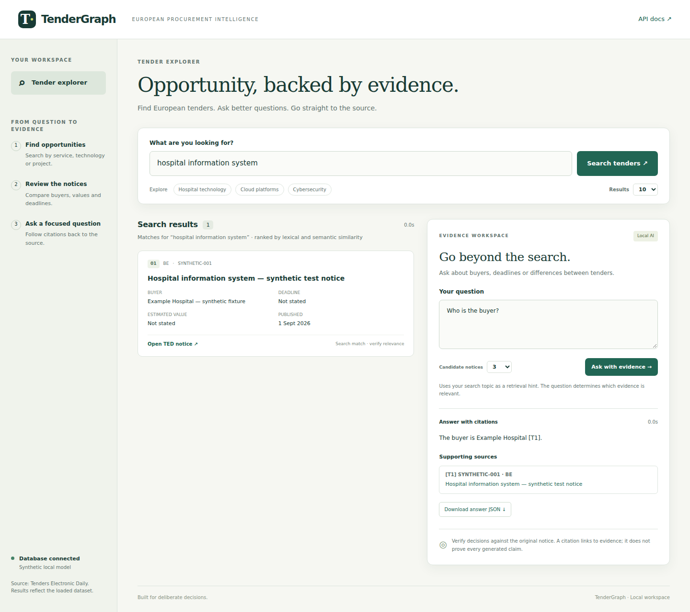
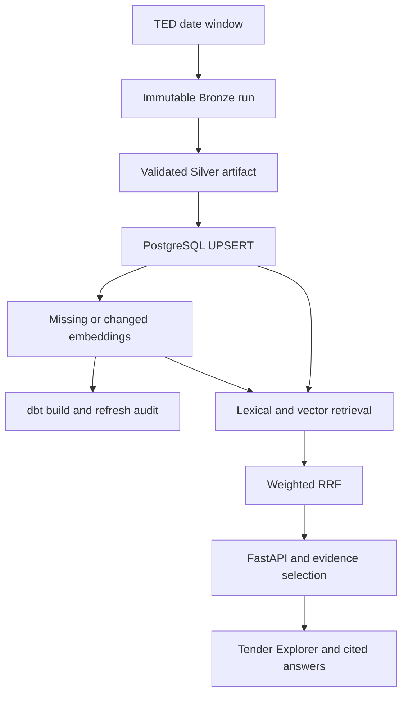

# TenderGraph — European Tender Intelligence

TenderGraph is a portfolio project I built to explore European public procurement
data from TED and practice an end-to-end data engineering and information-retrieval
workflow. It collects and normalizes tender notices, stores them in PostgreSQL,
compares lexical and semantic search, and exposes the results through a small
FastAPI web application.

Built by **Tanjim Hossain**. Python · PostgreSQL/pgvector · dbt · FastAPI · Ollama.

## What I implemented

- **Data engineering:** immutable Bronze runs, typed Silver normalization, validation,
  transactional notice UPSERTs, selective vector updates, dbt marts and refresh audits.
- **Information retrieval:** PostgreSQL full-text search and multilingual-e5-small
  embeddings, combined with weighted reciprocal rank fusion and evaluated against
  a small judged query set.
- **Applied AI:** local question answering with explicit evidence selection,
  citation validation, abstention, and links back to official notices.
- **Operations:** overlapping date-window refreshes, a macOS scheduler wrapper,
  freshness monitoring, deterministic CI checks and optional API container packaging.



The screenshot is a browser-test fixture, not a live procurement result.

## Architecture



See [architecture and consistency](docs/ARCHITECTURE.md) for failure boundaries,
retained artifacts and recovery behavior.

## Run locally

Requires Python 3.12, uv, Docker with Compose, and internet access for the initial
package/model downloads. For generated answers, run Ollama with the installed
`qwen3:4b-instruct` model. No paid API is required.

```bash
uv sync --frozen
make db-up
make db-health
make serve
```

Open **http://127.0.0.1:8000**. Search for `hospital information system`, then ask
“Who is the buyer, and what deadline is stated?” Follow the cited TED notice and
optionally download the answer JSON.

**New checkout:** first copy `.env.example` to `.env`, set your own database password,
and install/start Ollama if using the example's local AI mode. After starting
PostgreSQL, ingest an initial window with actual notices:

```bash
make refresh START_DATE=2026-09-21 END_DATE=2026-09-25
uv run --frozen python scripts/search_tenders.py "cloud platform" --limit 1
make serve
```

The lexical search command installs the generated full-text column and GIN index
idempotently. Initial refresh creates Silver/vector tables and runs dbt. If the
initial window has no notices, choose a populated window: a zero-result refresh
cannot bootstrap an empty database's schema. The example dates reproduce a
workflow, not the original historical dataset. No data or model weights ship in Git.

## Refresh and operations

```bash
make refresh START_DATE=2026-09-25 END_DATE=2026-09-26 COUNTRIES="BEL NLD DEU ITA"
make scheduled-refresh
curl -fsS http://127.0.0.1:8000/operations/status
```

The scheduled wrapper uses an inclusive three-day window ending at UTC yesterday.
Each run records retrieved/normalized counts, inserted/updated/unchanged notices,
embedding work, dbt outcome and failures under `data/refresh/`. Normal refreshes
preserve notices outside the requested window. Run refreshes serially.

A failed embedding stage can be retried even if Silver already committed. A
subsequent non-empty refresh reconciles missing/outdated vectors; for recovery
without another TED request use `make repair-embeddings`, then rerun dbt as described
in [operations](docs/OPERATIONS.md). Zero-match windows retain the existing no-op
behavior for Silver and embeddings, while still running dbt validation.

## Retrieval results

Macro averages across **8 queries and 288 judged query–notice pairs** from the
committed historical evaluation. These are existing results, not a new benchmark.
| System | P@10 | Recall@10 | MRR@10 | nDCG@10 |
| --- | ---: | ---: | ---: | ---: |
| Lexical | 0.2375 | 0.1040 | 0.4375 | 0.2317 |
| Semantic | 0.6125 | 0.4208 | 0.8750 | 0.6183 |
| Weighted hybrid RRF | 0.6625 | 0.4622 | 0.9375 | 0.6832 |
| Experimental cross-encoder | 0.7000 | 0.4809 | 0.8375 | 0.7054 |

The current retrieval settings use lexical weight **1.0**, semantic weight **1.25**, RRF
**k=60**, candidate depth **20**. Cross-encoder reranking remains experimental and
disabled by default. The small development set is insufficient for generalization
claims or further tuning. See [evaluation evidence](docs/EVALUATION.md) for metric
definitions, provenance and limitations.

## Answers and API

The example local configuration selects Ollama; the code's unconfigured fallback
remains `evidence`. `RAG_PROVIDER=evidence make serve` returns evidence without LLM
generation. Existing OpenAI support remains explicit opt-in, with no paid fallback.

| Endpoint | Purpose |
| --- | --- |
| `GET /` | Tender Explorer / Evidence Workspace |
| `POST /search` | Ranked lexical + semantic results |
| `POST /ask` | Evidence or generated answer, citations and selected sources |
| `GET /health` | Database connectivity after application startup |
| `GET /operations/status` | Audit-derived refresh status and freshness |
| `GET /config` | Public mode/model/reranking settings; no credentials |
| `GET /docs` | Interactive request and response schemas |

```bash
curl -fsS http://127.0.0.1:8000/ask \
  -H 'Content-Type: application/json' \
  -d '{"question":"Who is the buyer?","query":"hospital information system","evidence_limit":3,"retrieval_depth":20}'
```

Answer states are `answered`, `evidence_only`, `no_results` and
`insufficient_evidence`. Generated output must select known IDs and cite exactly
that selection. `RELEVANT: NONE` becomes a fixed insufficiency message with no
sources. Missing facts remain missing; amounts serialize as decimal strings.
Context truncation is disclosed. Citation validity does **not** establish factual
entailment, relevance, eligibility or resistance to all prompt injection.

## Quality and reproducibility

```bash
make check          # Ruff, mypy, pytest, offline answer-contract replay
make package        # sdist/wheel build and browser-asset packaging check
make evaluate-local # explicitly calls your configured local Ollama model
uv run --frozen python scripts/summarize_retrieval.py
```

`make check` needs no TED service, PostgreSQL, Ollama or API key. CI runs it with
model downloads disabled, verifies distribution packaging, and builds/import-checks
the API container without starting a database/model. Hosted CI is enabled and has
been verified successfully on GitHub. Browser tests and local live tests are documented
separately in [evaluation/answers/README.md](evaluation/answers/README.md).

## What I learned

Building this project helped me connect several topics that I had previously used
separately:

- designing an incremental data pipeline instead of repeatedly rebuilding a dataset
- validating data before loading it into PostgreSQL
- comparing lexical and semantic retrieval with reproducible metrics
- working with vector embeddings and pgvector
- handling partial pipeline failures and retrying only the affected work
- exposing data and retrieval functionality through FastAPI
- documenting evaluation limits instead of relying only on headline metrics

## Local demo and deployment notes

The native Mac workflow is the primary local demo. An opt-in non-root API image
and Compose overlay are included; see [deployment assessment](docs/DEPLOYMENT.md).
The overlay uses evidence mode because container loopback cannot reach the Mac's
Ollama daemon. It reuses the same PostgreSQL Compose project and volume.

This project is designed primarily as a local portfolio demo, **not as a public
production service**. It has no public authentication or request rate limits. Do not
expose it publicly without access control, TLS, resource limits, backups and
deployment validation. Historical evaluation artifacts are retained; live data,
secrets and audit logs stay out of Git. No hosted service has been deployed.
